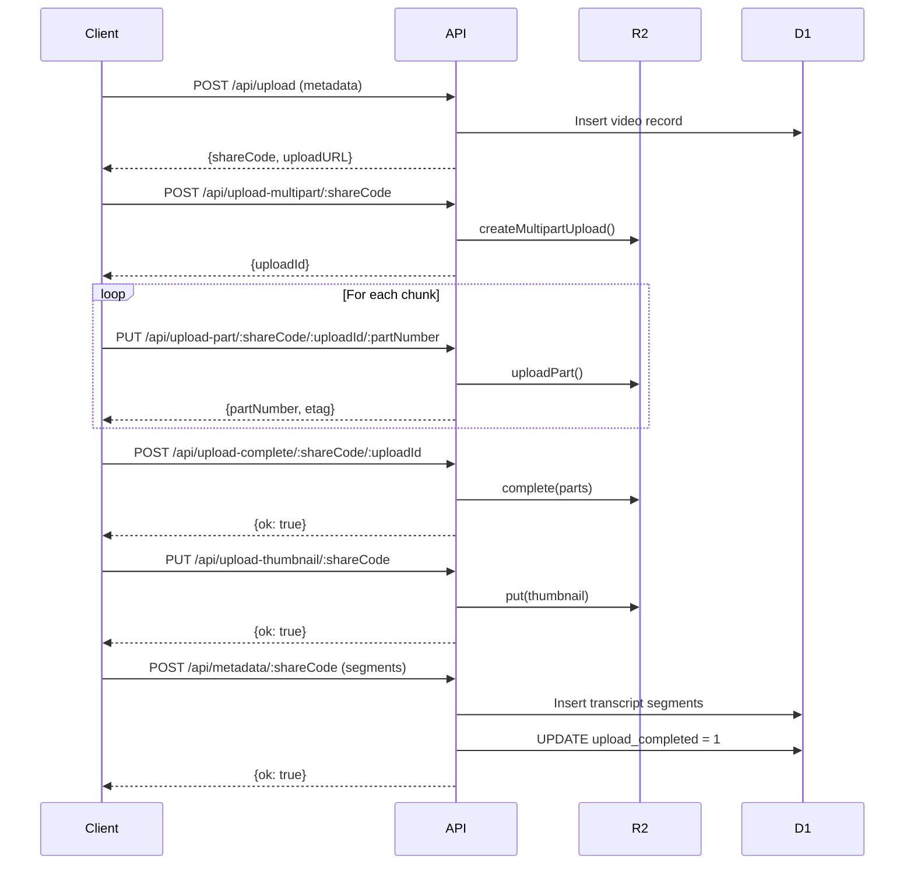

## Introduction

The Voom Share API is a Cloudflare Worker that provides video upload, storage, and sharing functionality. Videos are stored in R2, metadata in D1 SQLite, with automatic 30-day expiration.

## Base URL

All API requests are made to your deployed Cloudflare Worker:

```
https://your-worker.workers.dev
```

## Authentication

All `/api/*` endpoints require Bearer token authentication.

<Card title="Authentication" icon="lock" href="/api/authentication">
  Learn how to authenticate API requests
</Card>

## API Endpoints

### Upload Endpoints

<CardGroup cols={2}>
  <Card title="POST /api/upload" icon="upload">
    Create upload slot and get share code
  </Card>
  <Card title="PUT /api/upload-data/:shareCode" icon="file-video">
    Upload video file (simple upload)
  </Card>
  <Card title="POST /api/upload-multipart/:shareCode" icon="tasks">
    Start multipart upload for large files
  </Card>
  <Card title="PUT /api/upload-part/:shareCode/:uploadId/:partNumber" icon="puzzle-piece">
    Upload a single part in multipart upload
  </Card>
  <Card title="POST /api/upload-complete/:shareCode/:uploadId" icon="check-circle">
    Complete multipart upload
  </Card>
  <Card title="PUT /api/upload-thumbnail/:shareCode" icon="image">
    Upload thumbnail for OG image
  </Card>
</CardGroup>

### Metadata Endpoints

<Card title="POST /api/metadata/:shareCode" icon="database">
  Upload transcript segments, title, and summary
</Card>

### Management Endpoints

<CardGroup cols={2}>
  <Card title="POST /api/renew/:shareCode" icon="clock">
    Renew expiration date (+30 days)
  </Card>
  <Card title="DELETE /api/delete/:shareCode" icon="trash">
    Delete video and all associated data
  </Card>
</CardGroup>

## Public Endpoints (No Auth)

### Share Pages

<CardGroup cols={2}>
  <Card title="GET /s/:shareCode" icon="share">
    Video share page with player and transcript
  </Card>
  <Card title="GET /v/:shareCode" icon="play">
    Video file streaming (supports Range requests)
  </Card>
  <Card title="GET /og/:shareCode" icon="image">
    Open Graph thumbnail image
  </Card>
  <Card title="GET /thumb/:shareCode" icon="image">
    High-resolution thumbnail
  </Card>
</CardGroup>

## Upload Flow

The typical upload flow consists of four steps:



## Share Code Format

Share codes are 10-character alphanumeric strings using the alphabet:

```
abcdefghjkmnpqrstuvwxyz23456789
```

Excludes ambiguous characters (0, 1, i, l, o) for easy sharing.

## Expiration

- All videos expire **30 days** after creation
- `expires_at` is set on initial upload
- Use `POST /api/renew/:shareCode` to extend by another 30 days
- A cron job (`scheduled()`) runs daily to clean up expired videos

## Error Responses

All errors return JSON with an `error` field:

```json
{
  "error": "Error message here"
}
```

### Common HTTP Status Codes

| Code | Meaning |
|------|----------|
| `200` | Success |
| `400` | Bad request (missing required fields) |
| `401` | Unauthorized (missing or invalid Bearer token) |
| `404` | Not found (share code doesn't exist) |
| `500` | Internal server error |

## Rate Limiting

Cloudflare Workers have built-in rate limiting. For production use, consider implementing additional rate limiting using Durable Objects or KV.

## CORS

All API endpoints support CORS with:

```
Access-Control-Allow-Origin: *
Access-Control-Allow-Methods: GET, POST, PUT, DELETE, OPTIONS
Access-Control-Allow-Headers: Authorization, Content-Type
```

## Next Steps

<CardGroup cols={2}>
  <Card title="Authentication" icon="lock" href="/api/authentication">
    Set up Bearer token authentication
  </Card>
  <Card title="Upload Endpoints" icon="upload" href="/api/upload">
    Upload videos to R2 storage
  </Card>
  <Card title="Metadata" icon="database" href="/api/metadata">
    Add transcripts and summaries
  </Card>
  <Card title="Database Schema" icon="table" href="/api/schema">
    D1 database structure
  </Card>
</CardGroup>