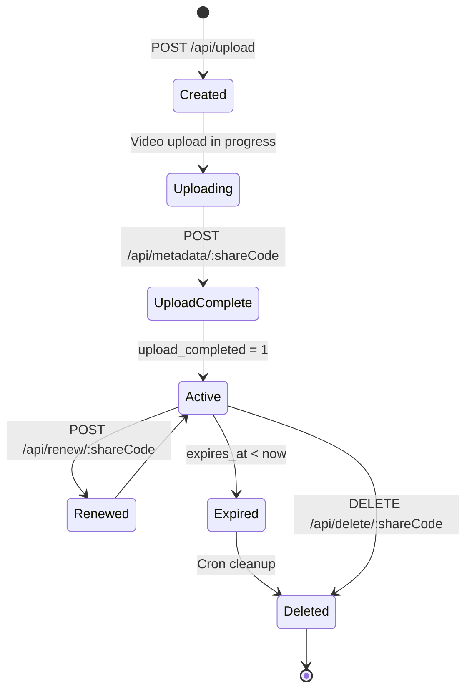

## Overview

Voom uses Cloudflare D1 (SQLite) to store video metadata and transcript segments. The schema is optimized for fast lookups by share code and efficient expiration queries.

## Tables

### videos

Stores video metadata, share URLs, and expiration information.

```sql
CREATE TABLE videos (
    id INTEGER PRIMARY KEY AUTOINCREMENT,
    share_code TEXT UNIQUE NOT NULL,
    title TEXT NOT NULL,
    duration REAL NOT NULL DEFAULT 0,
    width INTEGER NOT NULL DEFAULT 0,
    height INTEGER NOT NULL DEFAULT 0,
    has_webcam INTEGER NOT NULL DEFAULT 0,
    file_size INTEGER NOT NULL DEFAULT 0,
    created_at TEXT NOT NULL DEFAULT (datetime('now')),
    expires_at TEXT NOT NULL,
    upload_completed INTEGER NOT NULL DEFAULT 0,
    view_count INTEGER NOT NULL DEFAULT 0,
    summary TEXT
);
```

#### Columns

<ResponseField name="id" type="INTEGER" required>
  Primary key, auto-incrementing
</ResponseField>

<ResponseField name="share_code" type="TEXT" required>
  Unique 10-character share code (e.g., `"xk3m9q7r2w"`)
</ResponseField>

<ResponseField name="title" type="TEXT" required>
  Video title, set during upload
</ResponseField>

<ResponseField name="duration" type="REAL">
  Video duration in seconds (e.g., `120.5`)
</ResponseField>

<ResponseField name="width" type="INTEGER">
  Video width in pixels (e.g., `1920`)
</ResponseField>

<ResponseField name="height" type="INTEGER">
  Video height in pixels (e.g., `1080`)
</ResponseField>

<ResponseField name="has_webcam" type="INTEGER">
  Boolean flag (0 or 1) indicating webcam overlay presence
</ResponseField>

<ResponseField name="file_size" type="INTEGER">
  File size in bytes
</ResponseField>

<ResponseField name="created_at" type="TEXT">
  ISO 8601 timestamp, auto-set to current datetime
</ResponseField>

<ResponseField name="expires_at" type="TEXT" required>
  ISO 8601 expiration timestamp (30 days from creation)
</ResponseField>

<ResponseField name="upload_completed" type="INTEGER">
  Boolean flag (0 or 1). Set to 1 by `/api/metadata/:shareCode`. Videos are only publicly accessible when this is 1.
</ResponseField>

<ResponseField name="view_count" type="INTEGER">
  Incremented each time the share page is loaded
</ResponseField>

<ResponseField name="summary" type="TEXT">
  AI-generated or user-provided summary (optional, added via metadata endpoint)
</ResponseField>

#### Indexes

```sql
CREATE INDEX idx_videos_share_code ON videos(share_code);
CREATE INDEX idx_videos_expires_at ON videos(expires_at);
```

- **idx_videos_share_code**: Fast lookups by share code (used on every request)
- **idx_videos_expires_at**: Efficient expiration queries for cron cleanup

---

### transcript_segments

Stores transcript segments with start/end times for synchronized captions.

```sql
CREATE TABLE transcript_segments (
    id INTEGER PRIMARY KEY AUTOINCREMENT,
    video_id INTEGER NOT NULL REFERENCES videos(id) ON DELETE CASCADE,
    start_time REAL NOT NULL,
    end_time REAL NOT NULL,
    text TEXT NOT NULL
);
```

#### Columns

<ResponseField name="id" type="INTEGER" required>
  Primary key, auto-incrementing
</ResponseField>

<ResponseField name="video_id" type="INTEGER" required>
  Foreign key to `videos.id`, cascades on delete
</ResponseField>

<ResponseField name="start_time" type="REAL" required>
  Segment start time in seconds (e.g., `0.0`, `3.5`)
</ResponseField>

<ResponseField name="end_time" type="REAL" required>
  Segment end time in seconds (e.g., `3.5`, `8.2`)
</ResponseField>

<ResponseField name="text" type="TEXT" required>
  Transcript text for this segment
</ResponseField>

#### Indexes

```sql
CREATE INDEX idx_transcript_video_id ON transcript_segments(video_id);
```

- **idx_transcript_video_id**: Fast lookups for all segments of a video

---

## Schema File

From `schema.sql` (full source):

```sql
CREATE TABLE videos (
    id INTEGER PRIMARY KEY AUTOINCREMENT,
    share_code TEXT UNIQUE NOT NULL,
    title TEXT NOT NULL,
    duration REAL NOT NULL DEFAULT 0,
    width INTEGER NOT NULL DEFAULT 0,
    height INTEGER NOT NULL DEFAULT 0,
    has_webcam INTEGER NOT NULL DEFAULT 0,
    file_size INTEGER NOT NULL DEFAULT 0,
    created_at TEXT NOT NULL DEFAULT (datetime('now')),
    expires_at TEXT NOT NULL,
    upload_completed INTEGER NOT NULL DEFAULT 0,
    view_count INTEGER NOT NULL DEFAULT 0
);
CREATE INDEX idx_videos_share_code ON videos(share_code);
CREATE INDEX idx_videos_expires_at ON videos(expires_at);

CREATE TABLE transcript_segments (
    id INTEGER PRIMARY KEY AUTOINCREMENT,
    video_id INTEGER NOT NULL REFERENCES videos(id) ON DELETE CASCADE,
    start_time REAL NOT NULL,
    end_time REAL NOT NULL,
    text TEXT NOT NULL
);
CREATE INDEX idx_transcript_video_id ON transcript_segments(video_id);
```

**Note**: The `summary` field is added via `ALTER TABLE` or is part of a migration (not in the original schema file but used in the codebase).

---

## R2 Storage Structure

While not part of the D1 schema, videos and thumbnails are stored in R2:

```
VIDEOS_BUCKET/
├── videos/
│   └── {shareCode}.mp4
├── thumbnails/
│   └── {shareCode}.jpg
└── static/
    └── icon-64.png
```

### R2 Keys

<ResponseField name="videos/{shareCode}.mp4" type="video/mp4">
  Main video file, uploaded via `/api/upload-data/:shareCode` or multipart upload
</ResponseField>

<ResponseField name="thumbnails/{shareCode}.jpg" type="image/jpeg">
  High-resolution thumbnail, uploaded via `/api/upload-thumbnail/:shareCode`
</ResponseField>

<ResponseField name="static/icon-64.png" type="image/png">
  Voom app icon (64×64), served on share pages
</ResponseField>

---

## Database Queries

### Insert Video Record

From `index.js:160-165`:

```javascript
await env.DB.prepare(
  `INSERT INTO videos (share_code, title, duration, width, height, has_webcam, file_size, expires_at)
   VALUES (?, ?, ?, ?, ?, ?, ?, ?)`
)
  .bind(shareCode, title, duration || 0, width || 0, height || 0, hasWebcam ? 1 : 0, fileSize || 0, expiresAt)
  .run();
```

### Insert Transcript Segments (Batch)

From `index.js:249-255`:

```javascript
if (segments && segments.length > 0) {
  const stmt = env.DB.prepare(
    'INSERT INTO transcript_segments (video_id, start_time, end_time, text) VALUES (?, ?, ?, ?)'
  );
  const batch = segments.map(seg => stmt.bind(video.id, seg.startTime, seg.endTime, seg.text));
  await env.DB.batch(batch);
}
```

### Update Upload Completed

From `index.js:258-264`:

```javascript
if (title || summary) {
  await env.DB.prepare(
    'UPDATE videos SET upload_completed = 1, title = COALESCE(?, title), summary = ? WHERE share_code = ?'
  ).bind(title || null, summary || null, shareCode).run();
} else {
  await env.DB.prepare('UPDATE videos SET upload_completed = 1 WHERE share_code = ?').bind(shareCode).run();
}
```

### Fetch Video for Share Page

From `index.js:352-357`:

```javascript
const video = await env.DB.prepare(
  "SELECT * FROM videos WHERE share_code = ? AND upload_completed = 1"
)
  .bind(shareCode)
  .first();
```

### Fetch Transcript Segments

From `index.js:376-380`:

```javascript
const segments = await env.DB.prepare(
  'SELECT start_time, end_time, text FROM transcript_segments WHERE video_id = ? ORDER BY start_time'
)
  .bind(video.id)
  .all();
```

### Increment View Count

From `index.js:374`:

```javascript
await env.DB.prepare('UPDATE videos SET view_count = view_count + 1 WHERE id = ?').bind(video.id).run();
```

### Renew Expiration

From `index.js:272-274`:

```javascript
const result = await env.DB.prepare('UPDATE videos SET expires_at = ? WHERE share_code = ?')
  .bind(newExpiry, shareCode)
  .run();
```

### Delete Video and Segments

From `index.js:287-288`:

```javascript
await env.DB.prepare('DELETE FROM transcript_segments WHERE video_id = ?').bind(video.id).run();
await env.DB.prepare('DELETE FROM videos WHERE id = ?').bind(video.id).run();
```

### Find Expired Videos (Cron)

From `index.js:393-395`:

```javascript
const expired = await env.DB.prepare(
  "SELECT id, share_code FROM videos WHERE datetime(expires_at) < datetime('now')"
).all();
```

---

## Migrations

To apply the schema to your D1 database:

```bash
cd voom-share
npx wrangler d1 execute VOOM_SHARE_DB --file=./schema.sql
```

For schema changes, create migration files:

```bash
npx wrangler d1 migrations create VOOM_SHARE_DB add_summary_column
```

Then edit the generated migration:

```sql
-- migrations/0001_add_summary_column.sql
ALTER TABLE videos ADD COLUMN summary TEXT;
```

Apply migrations:

```bash
npx wrangler d1 migrations apply VOOM_SHARE_DB
```

---

## Data Lifecycle



### States

1. **Created**: Video record exists, `upload_completed = 0`
2. **Uploading**: Video/thumbnail/metadata being uploaded
3. **Upload Complete**: Metadata posted, `upload_completed = 1`
4. **Active**: Publicly accessible via share URL
5. **Renewed**: Expiration extended by 30 days
6. **Expired**: `expires_at` is in the past
7. **Deleted**: Removed from D1 and R2

---

## Performance Considerations

### Indexing Strategy

- **share_code index**: O(log n) lookup for all share page requests
- **expires_at index**: O(log n) range scan for cron cleanup
- **video_id index**: O(log n) join for transcript segments

### Query Optimization

- Use `upload_completed = 1` filter to avoid returning incomplete uploads
- Batch insert transcript segments to reduce round-trips
- Use `COALESCE` to conditionally update fields
- Foreign key cascade deletes reduce manual cleanup

### Scalability

- D1 SQLite handles millions of rows efficiently
- Indexes keep queries fast even with large datasets
- Cron cleanup prevents unbounded growth
- R2 storage is unlimited and cheap

---

## Next Steps

<CardGroup cols={2}>
  <Card title="Upload Endpoints" icon="upload" href="/api/upload">
    Start uploading videos to populate the database
  </Card>
  <Card title="Metadata" icon="database" href="/api/metadata">
    Add transcripts and summaries
  </Card>
  <Card title="Management" icon="tools" href="/api/management">
    Renew or delete videos
  </Card>
  <Card title="API Overview" icon="book" href="/api/overview">
    Return to API documentation home
  </Card>
</CardGroup>